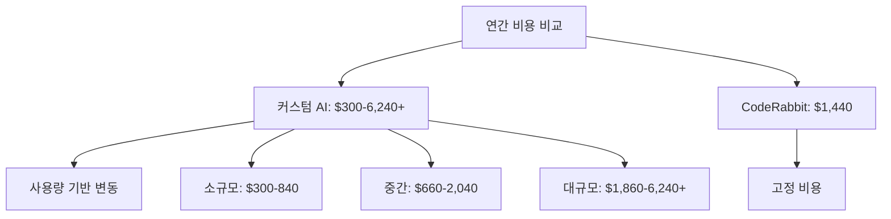

# 🔥 AI 코드 리뷰 시스템 비교 분석
*PPT 발표용 요약 자료*

---

## 📊 시스템 개요 비교

| 구분 | 커스텀 AI 시스템 | CodeRabbit |
|------|-----------------|------------|
| **유형** | 자체 구축 시스템 | SaaS 플랫폼 |
| **AI 모델** | GPT-5, Claude 4, Gemini 2.5 | 독자 LLM (비공개) |
| **모델 특성** | 범용 AI 3개 조합 | 코드 리뷰 특화 훈련 |
| **설치 방식** | GitHub Actions + Python | GitHub App 연동 |
| **커스터마이징** | 완전 자유 | 설정 파일 기반 |
| **유지보수** | 직접 관리 | 자동 업데이트 |

---

## ⚡ 핵심 기능 비교

### 🤖 **AI 리뷰 기능**

| 기능 | 커스텀 AI 시스템 | CodeRabbit | 승자 |
|------|-----------------|------------|------|
| **다중 AI 지원** | ✅ 3개 모델 동시 | ❌ 단일 모델 | 🏆 커스텀 |
| **보안 취약점 탐지** | ✅ 설정 가능 | ✅ 기본 제공 | 🤝 동점 |
| **성능 최적화 제안** | ✅ AI 기반 | ✅ 패턴 기반 | 🏆 커스텀 |
| **실시간 채팅** | ✅ 멘션 기반 | ✅ 네이티브 | 🏆 CodeRabbit |
| **한국어 지원** | ✅ 완벽 지원 | ✅ 기본 지원 | 🤝 동점 |
| **AI 모델 투명성** | ✅ 공개 (OpenAI, Anthropic, Google) | ❌ 비공개 독자 모델 | 🏆 커스텀 |
| **모델 업데이트 제어** | ✅ 직접 선택 | ❌ 자동 업데이트 | 🏆 커스텀 |

### 🔧 **설정 및 커스터마이징**

| 기능 | 커스텀 AI 시스템 | CodeRabbit | 승자 |
|------|-----------------|------------|------|
| **규칙 커스터마이징** | ✅ 무제한 | ⚠️ 제한적 | 🏆 커스텀 |
| **템플릿 수정** | ✅ 완전 자유 | ❌ 불가능 | 🏆 커스텀 |
| **AI 모델 선택** | ✅ 자유 선택 | ❌ 고정 | 🏆 커스텀 |
| **설정 편의성** | ⚠️ 복잡함 | ✅ 간단함 | 🏆 CodeRabbit |

### 🔌 **통합 및 확장성**

| 기능 | 커스텀 AI 시스템 | CodeRabbit | 승자 |
|------|-----------------|------------|------|
| **GitHub 통합** | ✅ Actions 기반 | ✅ App 기반 | 🤝 동점 |
| **Slack 알림** | ⚠️ 개발 필요 | ✅ 기본 제공 | 🏆 CodeRabbit |
| **Jira 연동** | ❌ 없음 | ✅ 기본 제공 | 🏆 CodeRabbit |
| **IDE 통합** | ❌ 없음 | ✅ 계획 중 | 🏆 CodeRabbit |

---

## 💰 비용 분석

### 📈 **시스템 비용 비교**

| 항목 | 커스텀 AI 시스템 | CodeRabbit |
|------|-----------------|------------|
| **초기 설정** | 무료 (오픈소스) | $12/월 per user |
| **AI API 비용** | 사용량 기반 (하단 참조) | 포함됨 |
| **GitHub Actions** | $5-20/월 | 무료 |
| ****월간 운영비** | **$5-20 + API 사용량** | **$12/월 per user** |

### 💡 **AI API 사용량 기반 비용** (커스텀 시스템)

| 사용량 수준 | 월간 API 비용 | 설명 |
|-------------|---------------|------|
| **소규모** | $20-50 | PR 5-10개/월, 간단한 리뷰 |
| **중간** | $50-150 | PR 20-50개/월, 일반적 사용 |
| **대규모** | $150-500+ | PR 100개+/월, 복잡한 리뷰 |

### 📊 **10인 팀 기준 월간/연간 비용**

| 사용량 | 커스텀 AI (월간) | 커스텀 AI (연간) | CodeRabbit (10명) |
|--------|------------------|------------------|-------------------|
| **소규모** | $25-70 | $300-840 | $120/월, $1,440/년 |
| **중간** | $55-170 | $660-2,040 | $120/월, $1,440/년 |
| **대규모** | $155-520+ | $1,860-6,240+ | $120/월, $1,440/년 |



---

## 🎯 편의성 & 사용성 비교

### ⏱️ **구축 시간**

| 단계 | 커스텀 AI 시스템 | CodeRabbit |
|------|-----------------|------------|
| **설치** | 2-4일 | 10분 |
| **설정** | 1-2일 | 30분 |
| **테스트** | 1일 | 즉시 |
| **운영 시작** | 4-7일 | 40분 |

### 🔧 **운영 편의성**

| 항목 | 커스텀 AI 시스템 | CodeRabbit | 점수 |
|------|-----------------|------------|------|
| **설정 변경** | 코드 수정 필요 | 웹 UI/YAML | CodeRabbit 승 |
| **장애 대응** | 직접 해결 | 자동 복구 | CodeRabbit 승 |
| **업데이트** | 수동 관리 | 자동 업데이트 | CodeRabbit 승 |
| **모니터링** | 직접 구축 | 대시보드 제공 | CodeRabbit 승 |

### 👥 **팀 온보딩**

| 요소 | 커스텀 AI 시스템 | CodeRabbit |
|------|-----------------|------------|
| **학습 곡선** | 높음 (기술적 지식 필요) | 낮음 (설정만) |
| **문서화** | 직접 작성 | 공식 문서 |
| **커뮤니티** | 없음 | 활발함 |

---

## ⚖️ 장단점 상세 분석

### 🏆 **커스텀 AI 시스템**

#### ✅ **장점**
- **다중 AI 활용**: GPT-5, Claude 4, Gemini 2.5 동시 사용
- **완전한 커스터마이징**: 모든 로직 수정 가능
- **비용 투명성**: API 사용량 직접 관리
- **데이터 주권**: 자체 인프라 내 데이터 처리
- **특화 기능**: 팀 특성에 맞는 고유 기능 개발

#### ❌ **단점**
- **높은 개발 비용**: 초기 구축비 $2,000-4,000
- **기술적 복잡성**: Python, GitHub Actions 지식 필요
- **유지보수 부담**: 지속적인 관리 필요
- **장애 책임**: 모든 문제를 직접 해결
- **확장성 한계**: 새 기능 개발에 시간 소요

### 🏆 **CodeRabbit**

#### ✅ **장점**
- **즉시 사용 가능**: 40분 내 운영 시작
- **전문적 AI**: 코드 리뷰 특화 모델
- **풍부한 통합**: Slack, Jira, IDE 등
- **자동 업데이트**: 지속적인 기능 개선
- **안정적 서비스**: 99.9% 가용성 보장

#### ❌ **단점**
- **제한된 커스터마이징**: 설정 파일 범위 내
- **벤더 종속성**: CodeRabbit 정책에 의존
- **단일 AI 모델**: 다양성 부족
- **지속적 비용**: 월간 구독 필요
- **데이터 외부 처리**: 보안 정책 고려 필요

---

## ⚙️ 시스템 설정 가이드

### 🔧 **커스텀 AI 시스템 설정**

#### **템플릿 시스템**

**AI 리뷰 결과 템플릿**:
```markdown
## 🤖 **{ai_name} AI 리뷰**

{review}

---

### 🤖 **AI 리뷰 정보**
- **🔧 모델**: {ai_name}
- **🎯 분석 범위**: 보안, 성능, 품질, 베스트 프랙티스

> 💡 추가 질문이나 더 자세한 설명이 필요하시면 @tkai-pr-bot을 호출해주세요!
**Happy Coding! 🚀**
```

**AI 리뷰 프롬프트 템플릿**:
```markdown
**PR 정보**
- 제목: {pr_title}
- 설명: {pr_description}
- 변경 파일: {file_count}개

**변경사항**
{all_changes}

**리뷰 요청**
다음 형식으로 간단하고 명확하게 리뷰해주세요:

## 개요
전체 변경사항에 대한 간단한 요약

## 주요 변경사항
| 파일명 | 변경 요약 |
|--------|-----------|
| 주요 파일 선정 | 주요 변경사항 요약 |

## 보안 및 품질
- 발견된 보안 취약점이나 품질 이슈 (있다면)
- 개선 제안사항 (있다면)

## Recommendation
✅ 승인 권장 / ⚠️ 수정 후 승인 / ❌ 승인 불가
```

**자동 승인 템플릿**:
```markdown
🤖 **AI 코드 리뷰 완료 - 승인**

모든 AI 리뷰에서 심각한 보안 취약점이나 버그가 발견되지 않았습니다.

### ✅ **검토 완료 항목**
- 🔒 **보안 취약점**: 검출되지 않음
- 🐛 **버그 가능성**: 심각한 이슈 없음  
- ⚡ **성능 문제**: 중대한 문제 없음
- 📝 **코드 품질**: 양호

**자동 승인되었습니다!** 🎉
```

**코멘트 응답 템플릿**:
```markdown
🤖 **AI 코드 어시스턴트 응답**

{ai_response}

---
> 💡 추가 질문이나 더 자세한 설명이 필요하시면 @tkai-pr-bot을 호출해주세요!
> 🔧 **AI 모델**: {ai_display_name}
```

**코멘트 요청 프롬프트 템플릿**:
```markdown
사용자 질문: "{comment_body}"

PR 정보: {pr_info}

변경된 파일 정보: {files_info}

모든 코멘트 정보: {comments_info}

위 PR 정보와 코멘트 히스토리를 바탕으로 사용자 질문에 구체적이고 도움이 되는 답변을 한국어로 해주세요.
```

**PR 규칙 위반 템플릿**:
```markdown
## ❌ PR 룰 위반이 감지되었습니다

**위반 사항:**
{violations}

---

## 📋 **PR 작성 가이드라인**

### 🏷️ **제목 (Title) 작성 규칙**
- **최소 10자 이상** 작성해주세요
- **명확하고 구체적인** 변경 내용을 포함해주세요
- **형식**: `[타입] 간단한 설명`
- **예시**: 
  - `[Feature] 사용자 로그인 기능 추가`
  - `[Fix] API 응답 오류 수정`
  - `[Refactor] 데이터베이스 연결 로직 개선`

### 📝 **설명 (Description) 작성 규칙**
- **최소 20자 이상** 작성해주세요
- **변경 이유와 목적**을 명확히 설명해주세요
- **주요 변경사항**을 bullet point로 나열해주세요
- **테스트 방법**이나 **검증 절차**를 포함해주세요

### ✅ **체크리스트**
- [ ] 제목이 변경 내용을 명확히 반영하는가?
- [ ] 설명이 충분히 상세한가?
- [ ] 관련 이슈나 티켓이 있다면 링크했는가?
- [ ] 테스트를 수행했는가?

**수정 후 다시 제출해주세요.** 🙏
> 💡 추가 질문이나 더 자세한 설명이 필요하시면 @tkai-pr-bot을 호출해주세요!
```

**리뷰 실패 템플릿**:
```markdown
## ❌ **AI 코드 리뷰 실패**

죄송합니다. AI 코드 리뷰 중 오류가 발생했습니다.

### 🔍 **가능한 원인**
- AI 서비스 일시적 장애
- 네트워크 연결 문제  
- API 키 설정 문제
- 파일 크기 초과 (너무 큰 변경사항)

### 🔄 **해결 방법**
1. **잠시 후 다시 시도**: 몇 분 후 다시 push하거나 PR을 업데이트해주세요
2. **수동 리뷰 요청**: 팀 리뷰어에게 수동 리뷰를 요청해주세요
3. **작은 단위로 분할**: 변경사항이 너무 크면 작은 단위로 나누어 제출해주세요
```

---

### 🤖 **CodeRabbit 설정**

#### **1. 기본 설정 파일**

**`.coderabbit.yaml`** (프로젝트 루트에 위치):
```yaml
# 기본 설정
language: "ko-KR"              # 리뷰 언어 (ko-KR, en-US 등)
early_access: false            # 베타 기능 활성화 여부

reviews:
  profile: "chill"             # 리뷰 톤 설정 (아래 설명 참조)
  request_changes_workflow: true    # PR 승인/거부 권한
  high_level_summary: true     # 전체 요약 제공
  poem: false                  # 시 형태 리뷰 비활성화
  review_status: true          # 리뷰 상태 표시
  auto_review:
    enabled: true              # 자동 리뷰 활성화
    drafts: false              # 드래프트 PR 리뷰 제외
    base_branches: ["main", "master"]  # 대상 브랜치

chat:
  auto_reply: true             # 질문에 자동 응답
```

#### **🎭 리뷰 프로필 비교 (profile 설정)**

| 프로필 | 특성 | 리뷰 스타일 | 적합한 팀 |
|--------|------|-------------|-----------|
| **assertive** | 직설적, 강력한 피드백 | - 명확한 문제 지적<br>- 강한 권고사항<br>- 엄격한 기준 적용 | - 시니어 개발자 팀<br>- 높은 품질 기준<br>- 빠른 개선 원함 |
| **chill** | 부드럽고 건설적인 피드백 | - 친근한 톤<br>- 제안 형태 피드백<br>- 격려와 함께 개선점 제시 | - 주니어 개발자 많음<br>- 학습 중심 환경<br>- 협력적 문화 |

**예시 비교**:
```yaml
# assertive 스타일
"이 함수는 복잡도가 너무 높습니다. 즉시 리팩터링이 필요합니다."

# chill 스타일  
"이 함수를 더 작은 단위로 나누면 읽기 쉬워질 것 같아요! 어떻게 생각하시나요?"
```

#### **2. 리뷰 대상 파일 설정**
```yaml
reviews:
  # 리뷰 대상 파일 패턴
  include_patterns:
    - "src/**/*.{js,ts,jsx,tsx}"
    - "lib/**/*.py"
    - "**/*.go"
    - "*.{md,yml,yaml,json}"
  
  # 리뷰 제외 파일 패턴
  exclude_patterns:
    - "node_modules/**"
    - "dist/**"
    - "build/**"
    - "*.min.js"
    - "coverage/**"
```

#### **3. 리뷰 품질 및 상세 설정**
```yaml
review_settings:
  # 리뷰 강도: low, medium, high
  thoroughness: "high"             # 리뷰 깊이
  
  # 중점 검토 영역
  focus_areas:
    - "security"                   # 보안 취약점
    - "performance"                # 성능 최적화  
    - "maintainability"            # 유지보수성
    - "testing"                    # 테스트 커버리지
    - "documentation"              # 문서화
    - "accessibility"              # 웹 접근성 (프론트엔드)
  
  # 언어별 특화 설정 (지원 언어: JavaScript, TypeScript, Python, Go, 
  # Java, C#, C++, Rust, PHP, Ruby, Swift, Kotlin 등 12개+ 언어)
  language_specific:
    javascript:
      check_async_patterns: true    # 비동기 패턴 검사
      enforce_typescript: true      # TypeScript 사용 권장
      check_console_statements: true # console.log 검사
      detect_unused_variables: true # 미사용 변수 감지
      es_version: "es2022"          # ECMAScript 버전
    
    python:
      check_pep8: true              # PEP 8 스타일 가이드
      security_analysis: true       # 보안 분석 강화
      type_hint_enforcement: true   # 타입 힌트 권장
      max_line_length: 88           # 라인 길이 제한
    
    java:
      enforce_java_conventions: true # Java 명명 규칙
      check_spring_patterns: true   # Spring 패턴 검사
      detect_null_pointer: true     # NPE 위험 감지
    
    go:
      gofmt_check: true             # gofmt 포맷팅 검사
      govet_analysis: true          # go vet 분석
      ineffassign_check: true       # 비효율적 할당 검사
    
    markdown:
      check_links: true             # 링크 유효성 검사
      spell_check: false            # 맞춤법 검사 (한국어 이슈)
      table_formatting: true        # 테이블 포맷팅
```

#### **4. 커스텀 규칙 설정**
```yaml
custom_rules:
  # 네이밍 컨벤션
  naming_conventions:
    functions: "camelCase"
    variables: "camelCase"
    constants: "UPPER_SNAKE_CASE"
    classes: "PascalCase"
  
  # 금지된 패턴들
  code_patterns:
    forbidden_patterns:
      - pattern: "console.log"
        message: "프로덕션 코드에서 console.log 사용을 피하세요."
        severity: "medium"
      
      - pattern: "eval\\("
        message: "eval() 함수는 보안 위험을 초래합니다."
        severity: "high"
      
      - pattern: "innerHTML\\s*="
        message: "innerHTML 직접 할당은 XSS 위험이 있습니다."
        severity: "medium"
```

#### **5. 보안 규칙 설정**
```yaml
security_rules:
  # 기본 보안 검사
  secrets_detection: true
  dependency_check: true
  sql_injection_check: true
  xss_prevention: true
  
  # 커스텀 보안 패턴
  custom_security_patterns:
    - pattern: "password\\s*=\\s*['\"].*['\"]"
      severity: "high"
      message: "하드코딩된 패스워드를 발견했습니다."
    
    - pattern: "api[_-]?key\\s*=\\s*['\"].*['\"]"
      severity: "high"
      message: "API 키가 하드코딩되어 있습니다."
```

#### **6. 성능 및 품질 임계값**
```yaml
performance_rules:
  # 성능 최적화 검사
  check_algorithmic_complexity: true   # 알고리즘 복잡도 분석
  detect_memory_leaks: true           # 메모리 누수 감지
  analyze_loop_efficiency: true       # 반복문 효율성 분석
  
  # 성능 관련 패턴
  performance_patterns:
    - pattern: "for\\s*\\(.*\\s*;\\s*.*\\.length\\s*;.*\\)"
      message: "반복문에서 매번 length를 계산하고 있습니다."
      severity: "low"

quality_rules:
  # 복잡도 임계값
  complexity_thresholds:
    cyclomatic: 10                    # 순환 복잡도
    cognitive: 15                     # 인지 복잡도  
    nesting_depth: 4                  # 중첩 깊이
  
  # 코드 중복 검사
  duplication_check:
    enabled: true
    minimum_lines: 5                  # 최소 중복 라인
  
  # 함수 크기 제한
  function_size:
    max_lines: 50                     # 최대 라인 수
    max_parameters: 5                 # 최대 매개변수 수
```

#### **7. 팀 설정 및 알림**
```yaml
team_settings:
  # 리뷰 할당 규칙  
  review_assignments:
    - reviewer: "senior-developer"
      condition: "high_complexity"     # 복잡한 코드는 시니어에게
    - reviewer: "security-team"  
      condition: "security_related"    # 보안 관련은 보안팀에게
    - reviewer: "performance-team"
      condition: "performance_critical" # 성능 이슈는 성능팀에게
  
  # 알림 설정
  notification_settings:
    # Slack 통합
    slack_webhook: "${SLACK_WEBHOOK_URL}"
    channels:
      - "#code-review"               # 일반 리뷰 알림
      - "#security-alerts"           # 보안 이슈 알림
      - "#performance-alerts"        # 성능 이슈 알림
    
    # 스팸 방지
    spam_prevention: true            # 스팸 방지 활성화
    minimum_severity: "medium"       # 최소 심각도
    batch_notifications: true        # 배치 알림
    
    # 조용한 시간 (한국 시간 기준)  
    quiet_hours:
      start: "22:00"                 # 알림 중단 시작
      end: "09:00"                   # 알림 재개 시간
      timezone: "Asia/Seoul"         # 시간대
      
    # 이메일 알림
    email_notifications:
      enabled: true
      digest_frequency: "daily"      # 일간 요약
```

#### **8. 학습 및 개선 설정**
```yaml
learning_settings:
  # 팀 피드백 통합
  team_feedback_integration: true    # 팀 피드백 학습
  
  # 잘못된 긍정 학습  
  false_positive_learning: true      # 오탐 학습
  
  # 컨텍스트 인식 수준
  context_awareness: "high"          # high, medium, low
  
  # 프로젝트별 패턴 학습
  project_specific_patterns: true    # 프로젝트 특화 학습
  
  # 점진적 개선
  adaptive_learning: true            # 적응적 학습

# 리포팅 설정
reporting:
  # 주간 리포트 생성
  weekly_reports: true               # 주간 리포트
  
  # 메트릭 수집
  collect_metrics:
    - "review_completion_time"       # 리뷰 완료 시간
    - "issue_detection_rate"         # 이슈 탐지율  
    - "false_positive_rate"          # 오탐률
    - "developer_satisfaction"       # 개발자 만족도
  
  # 대시보드 설정  
  dashboard_enabled: true            # 대시보드 활성화
  public_metrics: false              # 공개 메트릭 비활성화

# 실험적 기능
experimental_features:
  # AI 기반 코드 제안
  ai_suggestions: true               # AI 제안 활성화
  
  # 자동 수정 제안
  auto_fix_suggestions: false        # 안전을 위해 비활성화
  
  # 성능 프로파일링  
  performance_profiling: true        # 성능 프로파일링
  
  # 테스트 생성 제안
  test_generation: true              # 테스트 생성 제안
```

---

## 📋 **설정 복잡도 최종 비교**

| 설정 항목 | 커스텀 AI 시스템 | CodeRabbit |
|-----------|-----------------|------------|
| **설정 파일 수** | 15개+ (Python + YAML + 템플릿) | 1개 (.coderabbit.yaml) |
| **환경 변수** | 4개 (API 키들) | 0개 (선택적 Slack 등) |
| **GitHub 설정** | Actions 워크플로우 + Secrets | App 설치만 |
| **템플릿 커스터마이징** | 7개 템플릿 완전 자유 수정 | 불가능 (고정 템플릿) |
| **리뷰 프로필** | 코드로 직접 구현 | 2가지 (assertive/chill) |
| **언어별 설정** | Python 코드로 직접 구현 | 12개+ 언어 내장 지원 |
| **알림 시스템** | 직접 개발 필요 | Slack/이메일 내장 |
| **학습 기능** | 없음 (수동 개선) | 자동 학습 (피드백 기반) |
| **대시보드** | 직접 구축 필요 | 내장 대시보드 |
| **설정 변경 방법** | 코드 수정 + 재배포 | YAML 파일 수정 후 즉시 적용 |
| **학습 곡선** | 매우 높음 (프로그래밍 필수) | 낮음 (설정 파일만) |
| **유지보수 비용** | 지속적 개발자 투입 | 설정 관리만 |

### 🎛️ **설정 세부 항목 개수**

| 카테고리 | 커스텀 AI 시스템 | CodeRabbit |
|----------|-----------------|------------|
| **AI 모델 설정** | 3개 모델 × 각각 설정 | 1개 모델 고정 |
| **리뷰 규칙** | 무제한 (코드로 구현) | 50+ 내장 규칙 |
| **보안 패턴** | 직접 정의 | 20+ 내장 패턴 |
| **성능 규칙** | 직접 구현 | 10+ 내장 규칙 |
| **알림 채널** | 직접 개발 | 5개 채널 지원 |
| **언어 지원** | 모든 언어 (설정 필요) | 12개+ 언어 최적화 |

---

**AI 코드 리뷰 시스템 비교 분석 완료 🚀**
