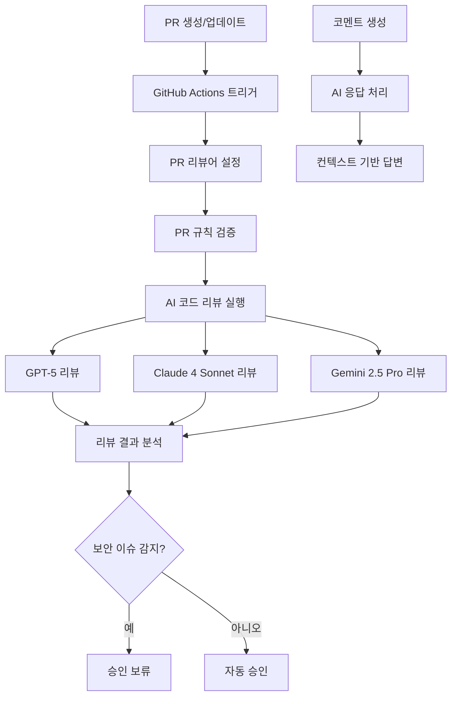
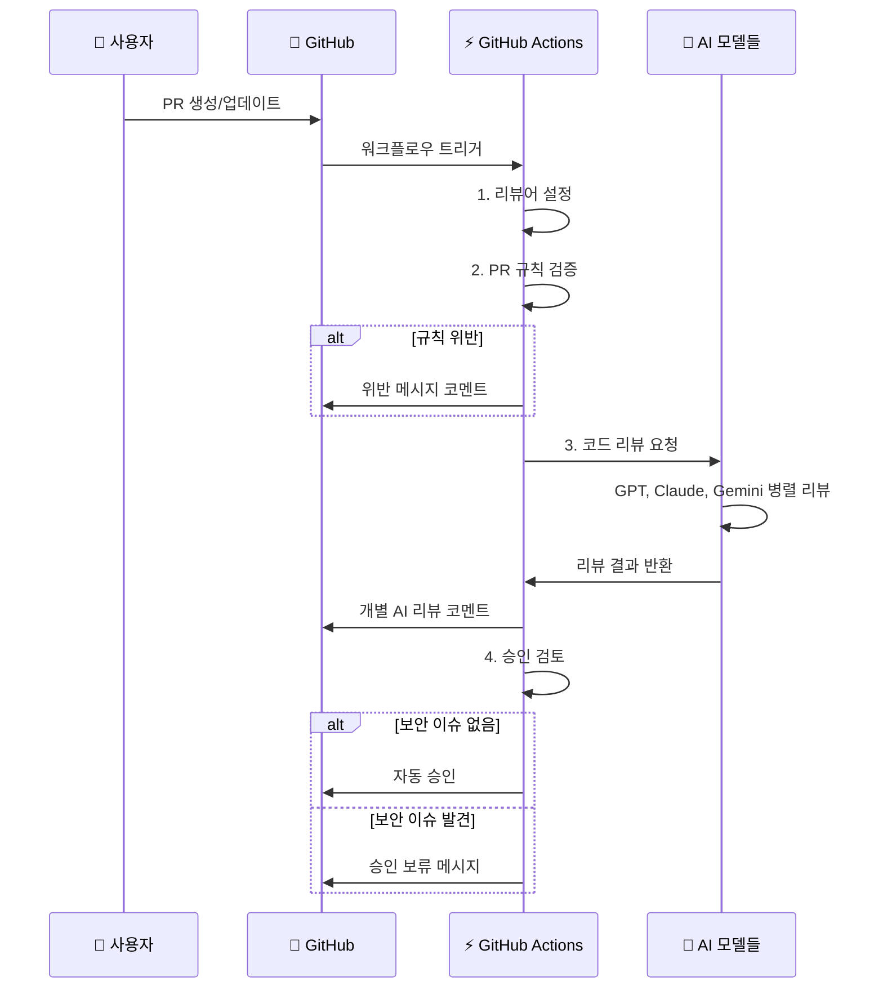
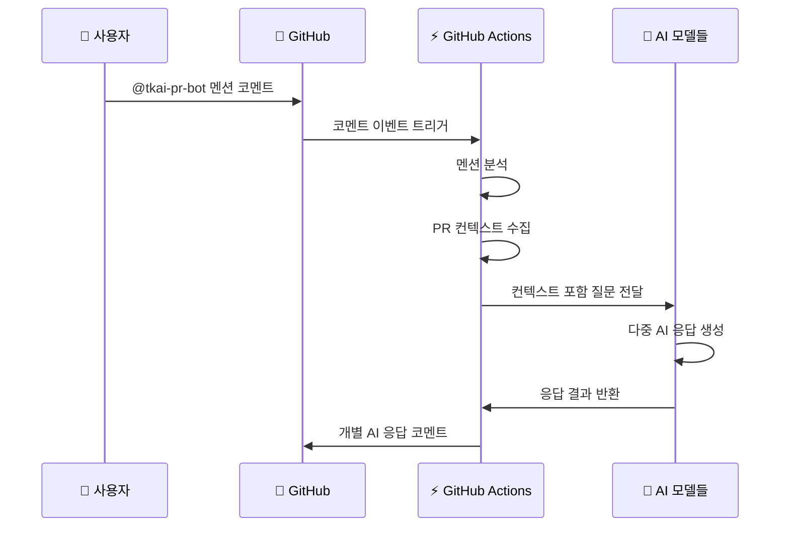

# 🤖 커스텀 AI 코드 리뷰 시스템 참조 문서

## 📋 목차
1. [시스템 개요](#-시스템-개요)
2. [시스템 아키텍처](#-시스템-아키텍처)
3. [구성 요소](#-구성-요소)
4. [설정 및 구성](#-설정-및-구성)
5. [워크플로우 동작](#-워크플로우-동작)
6. [AI 모델 설정](#-ai-모델-설정)
7. [템플릿 시스템](#-템플릿-시스템)
8. [사용법](#-사용법)
9. [문제 해결](#-문제-해결)
10. [커스터마이징](#-커스터마이징)

---

## 🎯 시스템 개요

이 커스텀 AI 코드 리뷰 시스템은 GitHub Actions를 기반으로 한 자동화된 PR 리뷰 시스템입니다. 다중 AI 모델(GPT, Claude, Gemini)을 활용하여 코드 품질, 보안, 성능 등을 종합적으로 분석하고 자동으로 승인까지 처리하는 완전 자동화 시스템입니다.

### 🌟 주요 특징
- **다중 AI 지원**: GPT-5, Claude 4 Sonnet, Gemini 2.5 Pro 동시 활용
- **완전 자동화**: PR 생성부터 승인까지 자동 처리
- **대화형 응답**: 코멘트를 통한 AI와의 실시간 상호작용
- **규칙 기반 검증**: PR 제목, 설명 등 기본 규칙 자동 검증
- **보안 중심**: 보안 취약점 자동 탐지 및 알림
- **템플릿 기반**: 유연한 메시지 템플릿 시스템

---

## 🏗️ 시스템 아키텍처



---

## 🧩 구성 요소

### 1. **GitHub Actions 워크플로우**
- **파일**: `.github/workflows/pr-review.yml`
- **역할**: 전체 리뷰 프로세스 오케스트레이션
- **트리거**: PR 생성/업데이트, 코멘트 생성

### 2. **핵심 Python 모듈**

#### 📊 AI 클라이언트 관리자
- **파일**: `ai_client_manager.py`
- **역할**: 모든 AI 클라이언트 통합 관리
- **기능**: 
  - 다중 AI 모델 초기화
  - 통합 API 인터페이스 제공
  - 설정 기반 AI 활성화/비활성화

#### 🔍 PR 코드 리뷰어
- **파일**: `pr_code_reviewer.py`
- **역할**: 실제 코드 리뷰 수행
- **기능**:
  - 변경사항 종합 분석
  - 다중 AI 병렬 리뷰
  - 리뷰 결과 포맷팅 및 게시

#### 👥 PR 리뷰어 관리자
- **파일**: `pr_reviewer_manager.py`
- **역할**: PR 리뷰어 자동 설정
- **기능**: github-actions[bot] 자동 추가

#### 📋 PR 규칙 검증기
- **파일**: `pr_rules_checker.py`
- **역할**: PR 기본 규칙 검증
- **기능**:
  - 제목/설명 길이 검증
  - 위반 시 자동 안내 메시지

#### ✅ PR 자동 승인기
- **파일**: `pr_approver.py`
- **역할**: 리뷰 결과 기반 자동 승인
- **기능**:
  - 보안 키워드 검사
  - 조건부 자동 승인
  - 승인 메시지 생성

#### 💬 코멘트 응답기
- **파일**: `comment_responder.py`
- **역할**: PR 코멘트 자동 응답
- **기능**:
  - 멘션 기반 응답 트리거
  - 컨텍스트 인식 답변
  - 다중 AI 응답 생성

### 3. **설정 파일**
- **파일**: `pr-review-config.yml`
- **역할**: 시스템 전역 설정
- **내용**: AI 모델 설정, 규칙, 키워드 등

### 4. **템플릿 시스템**
- **디렉토리**: `templates/`
- **역할**: 메시지 포맷팅
- **파일들**: 7개 템플릿 파일

---

## ⚙️ 설정 및 구성

### 🔑 필수 환경 변수

GitHub Repository Secrets에 다음 변수들을 설정해야 합니다:

```bash
# AI API 키들
OPENAI_API_KEY=sk-...          # GPT-5 API 키
ANTHROPIC_API_KEY=sk-ant-...   # Claude API 키  
GEMINI_API_KEY=AIza...         # Gemini API 키

# GitHub 토큰 (자동 제공)
GITHUB_TOKEN=${GITHUB_TOKEN}
```

### 📝 AI 모델 설정

`pr-review-config.yml`:
```yaml
ai_models:
  gpt:
    model: gpt-5
    enabled: true
    max_tokens: 10000
    temperature: 0.3
  claude:
    model: claude-sonnet-4-20250514
    enabled: true
    max_tokens: 10000
    temperature: 0.3
  gemini:
    model: gemini-2.5-pro
    enabled: true
    max_tokens: 10000
    temperature: 0.3
```

### 📏 PR 규칙 설정

```yaml
pr_rules:
  title:
    min_length: 10      # 제목 최소 길이
  description:
    min_length: 20      # 설명 최소 길이
```

### 🚨 보안 키워드 설정

```yaml
critical_keywords:
  - 보안, security
  - 취약점, vulnerability
  - sql injection, xss
  - 메모리 누수, memory leak
  - 무한루프, infinite loop
  - 심각, critical
  - 위험, dangerous
  - 버그, bug
```

### 🤖 봇 사용자 설정

```yaml
bot_users:
  - github-actions[bot]
  - github-actions
  - dependabot[bot]
```

### 📁 지원 파일 형식

```yaml
file_extensions:
  .py: python      .js: javascript
  .ts: typescript  .tsx: typescript
  .java: java      .go: go
  .rs: rust        .cpp: cpp
  .c: c            .php: php
  .rb: ruby        .swift: swift
  .kt: kotlin      .cs: csharp
  .html: html      .css: css
  .sql: sql        .sh: shell
  .yml: yaml       .yaml: yaml
  .json: json      .md: markdown
```

---

## 🔄 워크플로우 동작

### 1. **PR 리뷰 프로세스**



### 2. **코멘트 응답 프로세스**



---

## 🤖 AI 모델 설정

### GPT-5
- **모델명**: `gpt-5`
- **특징**: 최신 OpenAI 모델, 뛰어난 코드 이해
- **용도**: 복잡한 로직 분석, 아키텍처 리뷰

### Claude 4 Sonnet
- **모델명**: `claude-sonnet-4-20250514`
- **특징**: Anthropic의 최신 모델, 안전성 중심
- **용도**: 보안 취약점 탐지, 코드 품질 검증

### Gemini 2.5 Pro
- **모델명**: `gemini-2.5-pro`
- **특징**: Google의 멀티모달 모델
- **용도**: 종합적 코드 분석, 성능 최적화

### 모델별 역할 분담

| AI 모델 | 주요 역할 | 강점 |
|---------|-----------|------|
| GPT-5 | 전반적 코드 리뷰 | 논리적 분석, 아키텍처 |
| Claude 4 | 보안 중심 리뷰 | 안전성, 취약점 탐지 |
| Gemini 2.5 | 성능 최적화 | 효율성, 베스트 프랙티스 |

---

## 📝 템플릿 시스템

### 1. **code_review_result.md**
- **용도**: AI 리뷰 결과 포맷팅
- **변수**: `{ai_name}`, `{review}`

### 2. **comment_request.md**
- **용도**: 코멘트 응답용 프롬프트
- **변수**: `{comment_body}`, `{pr_info}`, `{files_info}`, `{comments_info}`

### 3. **comment_response.md**
- **용도**: AI 응답 포맷팅
- **변수**: `{ai_response}`, `{ai_display_name}`

### 4. **pr_approval.md**
- **용도**: 자동 승인 메시지
- **내용**: 승인 사유 및 검토 완료 항목

### 5. **pr_rule_violation.md**
- **용도**: PR 규칙 위반 안내
- **변수**: `{violations}`

### 6. **review_failure.md**
- **용도**: 리뷰 실패 시 안내
- **내용**: 실패 원인 및 해결 방법

### 7. **review_prompt.md**
- **용도**: AI 리뷰 프롬프트
- **변수**: `{pr_title}`, `{pr_description}`, `{file_count}`, `{all_changes}`

---

## 🚀 사용법

### 1. **기본 사용법**

1. PR 생성 또는 업데이트
2. 시스템이 자동으로 리뷰 수행
3. 개별 AI 리뷰 결과 확인
4. 자동 승인 또는 수동 검토

### 2. **AI와 대화하기**

PR 코멘트에서 `@tkai-pr-bot`을 멘션하여 질문:

```markdown
@tkai-pr-bot 이 코드에서 성능 개선할 부분이 있을까요?
```

```markdown
@tkai-pr-bot 보안 측면에서 문제없나요?
```

### 3. **코멘트 예시**

#### ✅ 성공적인 리뷰
```markdown
🤖 **GPT-5 AI 리뷰**

## 개요
이번 PR은 사용자 인증 로직을 개선하는 변경사항입니다.

## 주요 변경사항
| 파일명 | 변경 요약 |
|--------|-----------|
| auth.py | JWT 토큰 검증 로직 강화 |
| models.py | User 모델에 보안 필드 추가 |

## 보안 및 품질
- JWT 시크릿 키가 환경변수로 안전하게 관리됨
- 패스워드 해싱 알고리즘이 bcrypt로 적절함

## Recommendation
✅ 승인 권장

---
🔧 **모델**: GPT-5
🎯 분석 범위: 보안, 성능, 품질, 베스트 프랙티스
```

#### ⚠️ 보안 이슈 발견
```markdown
🤖 **Claude 4 Sonnet AI 리뷰**

## 개요
데이터베이스 쿼리 로직에서 보안 취약점이 발견되었습니다.

## 보안 및 품질
- ⚠️ SQL Injection 취약점: user_input을 직접 쿼리에 삽입
- 권장: Prepared Statement 또는 ORM 사용

## Recommendation
❌ 수정 후 재검토 필요
```

---

## 🔧 문제 해결

### 1. **AI 리뷰 실패**

**증상**: "AI 코드 리뷰 실패" 메시지
**원인**: 
- API 키 설정 오류
- AI 서비스 장애
- 너무 큰 변경사항

**해결책**:
```bash
# 1. API 키 확인
echo $OPENAI_API_KEY | head -c 10

# 2. 변경사항 크기 확인
git diff --stat

# 3. 작은 단위로 분할 제출
```

### 2. **봇이 응답하지 않음**

**원인**: 
- 멘션 오타 (`@tkai-pr-bot`)
- 봇 계정 권한 부족

**해결책**:
```yaml
# .github/pr-review-config.yml에서 봇 사용자 확인
bot_users:
  - github-actions[bot]
  - tkai-pr-bot  # 정확한 봇 이름 확인
```

### 3. **승인이 되지 않음**

**원인**: 보안 키워드 감지

**해결책**:
```yaml
# critical_keywords 리스트 확인 및 조정
critical_keywords:
  - 보안    # 이 키워드가 리뷰에 포함되면 승인 보류
  - 취약점
  - bug
```

---

## 🎨 커스터마이징

### 1. **새로운 AI 모델 추가**

`ai_client_manager.py`에 새 모델 추가:
```python
def init_new_ai(self):
    """새로운 AI 클라이언트 초기화"""
    if not self.config.get('ai_models', {}).get('new_ai', {}).get('enabled', True):
        return
    
    new_ai_key = os.environ.get('NEW_AI_API_KEY')
    if new_ai_key:
        try:
            # 새 AI 클라이언트 초기화 로직
            pass
        except Exception as e:
            print(f"❌ 새 AI 초기화 실패: {e}")
```

### 2. **새로운 검증 규칙 추가**

`pr_rules_checker.py`에 규칙 추가:
```python
def validate_branch_name(self):
    """브랜치 이름 규칙 검증"""
    violations = []
    branch_name = self.pr.head.ref
    
    if not re.match(r'^(feature|fix|hotfix)/', branch_name):
        violations.append("브랜치명이 규칙에 맞지 않습니다")
    
    return violations
```

### 3. **커스텀 템플릿 생성**

`templates/` 디렉토리에 새 템플릿 추가:
```markdown
<!-- custom_template.md -->
## 🎯 **커스텀 리뷰 결과**

{custom_content}

---
**커스텀 메시지**: 이것은 사용자 정의 템플릿입니다.
```

### 4. **워크플로우 수정**

`.github/workflows/pr-review.yml`에 단계 추가:
```yaml
- name: 🔒 보안 스캔
  run: |
    # 추가 보안 검사 도구 실행
    bandit -r . -f json -o security-report.json
```

---

## 📊 시스템 성능

### 처리 시간
- **평균 리뷰 시간**: 2-5분
- **다중 AI 병렬 처리**: 3개 AI 동시 실행
- **API 호출 최적화**: 배치 처리 지원

### 리소스 사용량
- **GitHub Actions 런타임**: 우분투 최신
- **Python 버전**: 3.11
- **메모리 사용량**: 평균 512MB

### 지원 한계
- **최대 파일 크기**: 1MB per file
- **최대 변경사항**: 50개 파일
- **토큰 제한**: 모델별 10,000 토큰

---

## 🔒 보안 고려사항

### API 키 관리
- GitHub Secrets 사용 필수
- 정기적인 키 로테이션 권장
- 환경별 키 분리

### 권한 설정
```yaml
permissions:
  contents: read      # 코드 읽기
  pull-requests: write # PR 코멘트/승인
  issues: write       # 이슈 코멘트
```

### 데이터 보안
- API 요청시 코드 내용 전송
- AI 서비스 프라이버시 정책 확인
- 민감한 정보 필터링 고려

---

## 📈 모니터링 및 로깅

### 로그 확인
```bash
# GitHub Actions 로그에서 확인
🚀 AI 코드 리뷰 시작 - PR #123
✅ GPT-5 클라이언트 초기화 완료
✅ Claude 4 Sonnet 클라이언트 초기화 완료
✅ Gemini 2.5 Pro 클라이언트 초기화 완료
🔍 GPT-5으로 3개 파일 리뷰 중...
✅ GPT-5 리뷰 완료
✅ 리뷰 코멘트 작성 완료
```

### 성능 메트릭
- API 응답 시간
- 성공률 추적
- 오류 유형 분석

---

## 🔄 업데이트 및 유지보수

### 정기 업데이트
1. **AI 모델 버전**: 최신 모델로 업그레이드
2. **종속성 패키지**: `requirements.txt` 업데이트
3. **템플릿 개선**: 사용자 피드백 반영

### 백업 및 복원
```bash
# 설정 파일 백업
cp .github/pr-review-config.yml backup/
cp -r .github/git_rules/ backup/

# 복원
cp backup/pr-review-config.yml .github/
cp -r backup/git_rules/ .github/
```

---

## 📞 지원 및 문의

### 문제 보고
- GitHub Issues 활용
- 로그 파일 첨부
- 재현 단계 상세 기술

### 기능 요청
- Enhancement 라벨 사용
- 사용 사례 명시
- 우선순위 표시

---

## 📚 참고 자료

### 관련 문서
- [GitHub Actions 문서](https://docs.github.com/en/actions)
- [OpenAI API 문서](https://platform.openai.com/docs)
- [Anthropic API 문서](https://docs.anthropic.com)
- [Google AI API 문서](https://ai.google.dev)

### 예제 프로젝트
- 현재 프로젝트가 완전한 구현 예제
- 템플릿 커스터마이징 예제 포함
- 다양한 언어 지원 예제

---

## 🎉 결론

이 커스텀 AI 코드 리뷰 시스템은 현대적인 소프트웨어 개발 워크플로우에 AI의 힘을 통합한 혁신적인 솔루션입니다. 다중 AI 모델의 협력을 통해 더욱 정확하고 포괄적인 코드 리뷰를 제공하며, 완전 자동화를 통해 개발 팀의 생산성을 크게 향상시킵니다.

**Happy Coding with AI! 🚀**

---

*마지막 업데이트: 2024년 12월*
*버전: 1.0.0*
