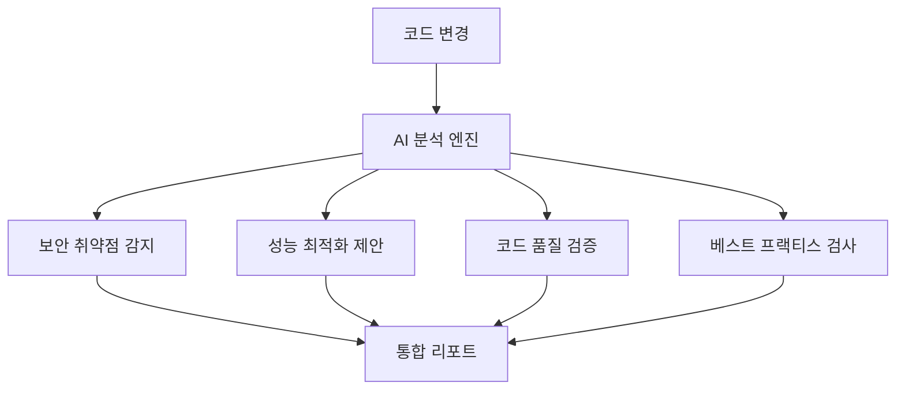
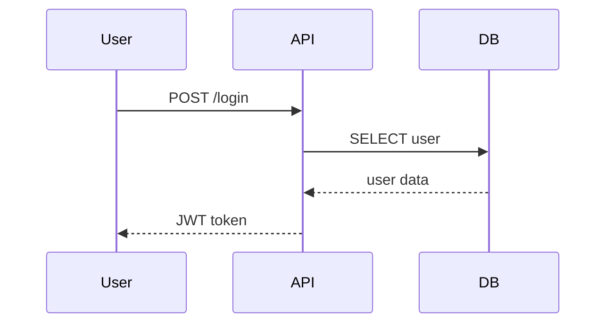
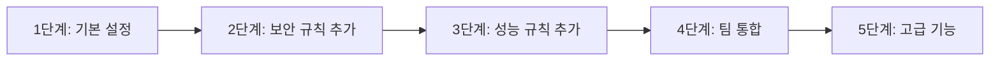

# 🤖 CodeRabbit AI 코드 리뷰 시스템 완전 가이드

## 📋 목차
1. [CodeRabbit 개요](#-coderabbit-개요)
2. [주요 특징](#-주요-특징)
3. [설치 및 설정](#-설치-및-설정)
4. [설정 파일 (.coderabbit.yaml)](#-설정-파일-coderabbit-yaml)
5. [보안 규칙 설정](#-보안-규칙-설정)
6. [성능 및 품질 규칙](#-성능-및-품질-규칙)
7. [팀 설정 및 알림](#-팀-설정-및-알림)
8. [Extensions 및 통합](#-extensions-및-통합)
9. [실제 테스트 결과](#-실제-테스트-결과)
10. [고급 설정](#-고급-설정)
11. [문제 해결](#-문제-해결)
12. [모범 사례](#-모범-사례)

---

## 🎯 CodeRabbit 개요

**CodeRabbit**은 AI 기반의 자동화된 코드 리뷰 플랫폼으로, GitHub 및 GitLab과 원활하게 통합되어 Pull Request마다 지능적인 코드 분석을 제공합니다.

### 🌟 핵심 가치
- **자동화된 리뷰**: 모든 PR에 대해 즉시 분석 제공
- **AI 학습**: 팀의 코딩 스타일과 패턴을 학습
- **다국어 지원**: 한국어 포함 다양한 언어로 리뷰 제공
- **실시간 채팅**: AI와 직접 대화하며 코드 개선
- **지속적 개선**: 피드백을 통한 리뷰 품질 향상

### 📊 지원 기술 스택
```yaml
languages:
  - JavaScript/TypeScript
  - Python
  - Go
  - Java
  - C/C++
  - Rust
  - Swift
  - Kotlin
  - Ruby
  - PHP
  - C#
```

---

## ✨ 주요 특징

### 1. **지능형 코드 분석**


### 2. **실시간 상호작용**
- **ChatOps**: PR 코멘트에서 AI와 직접 대화
- **질문 기능**: 특정 코드에 대한 설명 요청
- **개선 제안**: 실시간 코드 최적화 아이디어

### 3. **학습 기반 개선**
- **팀 스타일 학습**: 기존 코드베이스 패턴 분석
- **false positive 감소**: 잘못된 경고 학습 및 개선
- **컨텍스트 인식**: 프로젝트별 맞춤 분석

---

## 🚀 설치 및 설정

### 1. **GitHub 연동**
1. GitHub Marketplace에서 CodeRabbit 설치
2. Repository 권한 설정
3. `.coderabbit.yaml` 설정 파일 생성

### 2. **기본 설정**
```yaml
# 기본 .coderabbit.yaml
language: "ko-KR"
early_access: false
reviews:
  profile: "chill"  # assertive, chill 중 선택
  request_changes_workflow: true
  high_level_summary: true
  poem: false
  review_status: true
  auto_review:
    enabled: true
    drafts: false
chat:
  auto_reply: true
```

### 3. **권한 설정**
```yaml
permissions:
  contents: read
  pull-requests: write
  issues: write
  checks: write
```

---

## ⚙️ 설정 파일 (.coderabbit.yaml)

### 📁 파일 위치
```
your-repo/
├── .coderabbit.yaml    # 루트 디렉토리에 위치
├── src/
└── README.md
```

### 🔧 전체 설정 구조

#### **1. 리뷰 기본 설정**
```yaml
reviews:
  # 자동 리뷰 활성화
  auto_review: true
  
  # 리뷰 대상 파일 패턴
  include_patterns:
    - "src/**/*.{js,ts,jsx,tsx}"
    - "lib/**/*.py"
    - "**/*.go"
    - "test-files/**/*.js"
    - "*.{md,yml,yaml,json}"
  
  # 리뷰 제외 파일 패턴
  exclude_patterns:
    - "node_modules/**"
    - "dist/**"
    - "build/**"
    - "*.min.js"
    - "coverage/**"
    - "vendor/**"
    - ".git/**"
```

#### **2. 리뷰 세부 설정**
```yaml
review_settings:
  # 리뷰 강도: low, medium, high
  thoroughness: "high"
  
  # 중점 검토 영역
  focus_areas:
    - "security"          # 보안 취약점
    - "performance"       # 성능 최적화
    - "maintainability"   # 유지보수성
    - "testing"           # 테스트 커버리지
    - "documentation"     # 문서화
  
  # 언어별 특화 설정
  language_specific:
    javascript:
      check_async_patterns: true
      enforce_typescript: true
      check_console_statements: true
      detect_unused_variables: true
    
    python:
      check_pep8: true
      security_analysis: true
      type_hint_enforcement: true
    
    markdown:
      check_links: true
      spell_check: false  # 한국어 지원 이슈로 비활성화
```

#### **3. 커스텀 규칙**
```yaml
custom_rules:
  # 네이밍 컨벤션
  naming_conventions:
    functions: "camelCase"
    variables: "camelCase"
    constants: "UPPER_SNAKE_CASE"
    classes: "PascalCase"
  
  # 금지된 패턴들
  code_patterns:
    forbidden_patterns:
      - pattern: "console.log"
        message: "프로덕션 코드에서 console.log 사용을 피하세요."
        severity: "medium"
      
      - pattern: "TODO:"
        message: "TODO 주석은 GitHub 이슈로 등록하세요."
        severity: "low"
      
      - pattern: "eval\\("
        message: "eval() 함수는 보안 위험을 초래합니다."
        severity: "high"
      
      - pattern: "innerHTML\\s*="
        message: "innerHTML 직접 할당은 XSS 위험이 있습니다."
        severity: "medium"
```

---

## 🔒 보안 규칙 설정

### **기본 보안 검사**
```yaml
security_rules:
  # 기본 보안 검사
  secrets_detection: true
  dependency_check: true
  sql_injection_check: true
  xss_prevention: true
  
  # 커스텀 보안 패턴
  custom_security_patterns:
    - pattern: "password\\s*=\\s*['\"].*['\"]"
      severity: "high"
      message: "하드코딩된 패스워드를 발견했습니다. 환경변수를 사용하세요."
    
    - pattern: "api[_-]?key\\s*=\\s*['\"].*['\"]"
      severity: "high"
      message: "API 키가 하드코딩되어 있습니다. 환경변수로 관리하세요."
    
    - pattern: "SELECT\\s+.*\\s+FROM\\s+.*\\s*\\+\\s*"
      severity: "high"
      message: "SQL 인젝션 취약점이 의심됩니다. Prepared Statement를 사용하세요."
```

### **실제 보안 탐지 예시**

#### ❌ **위험한 코드**
```javascript
// SQL Injection 위험
const query = "SELECT * FROM users WHERE id = " + userId;

// 하드코딩된 시크릿
const API_KEY = "sk-1234567890abcdef";

// eval() 사용
return eval(userInput);
```

#### ✅ **안전한 코드**
```javascript
// Prepared Statement 사용
const query = "SELECT * FROM users WHERE id = ?";
db.execute(query, [userId]);

// 환경변수 사용
const API_KEY = process.env.API_KEY;

// 안전한 대안 사용
return JSON.parse(userInput);
```

---

## ⚡ 성능 및 품질 규칙

### **성능 최적화 검사**
```yaml
performance_rules:
  # 성능 최적화 검사
  check_algorithmic_complexity: true
  detect_memory_leaks: true
  analyze_loop_efficiency: true
  
  # 성능 관련 패턴
  performance_patterns:
    - pattern: "for\\s*\\(.*\\s*;\\s*.*\\.length\\s*;.*\\)"
      message: "반복문에서 매번 length를 계산하고 있습니다."
      severity: "low"
```

### **코드 품질 규칙**
```yaml
quality_rules:
  # 복잡도 임계값
  complexity_thresholds:
    cyclomatic: 10      # 순환 복잡도
    cognitive: 15       # 인지 복잡도
    nesting_depth: 4    # 중첩 깊이
  
  # 코드 중복 검사
  duplication_check:
    enabled: true
    minimum_lines: 5
  
  # 함수 크기 제한
  function_size:
    max_lines: 50
    max_parameters: 5
```

### **성능 최적화 예시**

#### ❌ **비효율적인 코드**
```javascript
// O(n²) 버블 정렬
function slowSort(arr) {
    for (let i = 0; i < arr.length; i++) {
        for (let j = 0; j < arr.length - 1; j++) {
            if (arr[j] > arr[j + 1]) {
                [arr[j], arr[j + 1]] = [arr[j + 1], arr[j]];
            }
        }
    }
    return arr;
}

// length를 매번 계산
for (let i = 0; i < items.length; i++) {
    process(items[i]);
}
```

#### ✅ **최적화된 코드**
```javascript
// 내장 정렬 사용 O(n log n)
function efficientSort(arr) {
    return [...arr].sort((a, b) => a - b);
}

// length를 한 번만 계산
const len = items.length;
for (let i = 0; i < len; i++) {
    process(items[i]);
}
```

---

## 👥 팀 설정 및 알림

### **리뷰 할당 규칙**
```yaml
team_settings:
  # 리뷰 할당 규칙
  review_assignments:
    - reviewer: "senior-developer"
      condition: "high_complexity"
    - reviewer: "security-team"
      condition: "security_related"
    - reviewer: "performance-team"
      condition: "performance_critical"
  
  # 알림 설정
  notification_settings:
    # Slack 웹훅
    slack_webhook: "${SLACK_WEBHOOK_URL}"
    channels:
      - "#code-review"
      - "#security-alerts"
    
    # 스팸 방지
    spam_prevention: true
    minimum_severity: "medium"
    batch_notifications: true
    
    # 조용한 시간 (한국 시간 기준)
    quiet_hours:
      start: "22:00"
      end: "09:00"
      timezone: "Asia/Seoul"
```

### **알림 메시지 예시**
```json
{
  "text": "🔍 CodeRabbit 리뷰 완료",
  "attachments": [
    {
      "color": "warning",
      "title": "PR #123: 사용자 인증 개선",
      "fields": [
        {
          "title": "보안 이슈",
          "value": "2개 발견",
          "short": true
        },
        {
          "title": "성능 개선",
          "value": "3개 제안",
          "short": true
        }
      ]
    }
  ]
}
```

---

## 🔌 Extensions 및 통합

### **지원되는 통합**

#### **1. 이슈 트래킹 시스템**
```yaml
integrations:
  jira:
    enabled: true
    server_url: "https://your-company.atlassian.net"
    project_key: "PROJ"
    
  linear:
    enabled: true
    workspace: "your-workspace"
    
  github_issues:
    enabled: true
    auto_create: true
    labels: ["code-review", "ai-detected"]
```

#### **2. CI/CD 파이프라인**
```yaml
ci_integration:
  github_actions:
    enabled: true
    required_checks: true
    
  jenkins:
    webhook_url: "https://jenkins.company.com/webhook"
    
  circleci:
    enabled: true
```

#### **3. 코드 품질 도구**
```yaml
quality_tools:
  sonarqube:
    enabled: true
    server_url: "https://sonar.company.com"
    
  eslint:
    config_file: ".eslintrc.js"
    
  prettier:
    config_file: ".prettierrc"
```

### **확장 기능**

#### **1. 시퀀스 다이어그램 생성**
```yaml
diagrams:
  sequence_diagrams: true
  architecture_diagrams: true
  flow_charts: true
```

**생성 예시:**


#### **2. 보안 스캔 확장**
```yaml
security_extensions:
  vulnerability_scanner: true
  dependency_audit: true
  secrets_scanner: true
  license_checker: true
```

#### **3. 성능 프로파일링**
```yaml
performance_extensions:
  memory_analysis: true
  cpu_profiling: false  # 리소스 집약적
  bundle_analysis: true
```

---

## 🧪 실제 테스트 결과

### **테스트 파일: vulnerable-code-new.js**

#### **CodeRabbit 탐지 결과**
```markdown
🚨 **심각한 보안 취약점 발견**

1. **SQL Injection** (Line 9)
   - 문제: 사용자 입력을 직접 쿼리에 삽입
   - 해결: Prepared Statement 사용

2. **eval() 사용** (Line 17)
   - 문제: 극도로 위험한 코드 실행
   - 해결: JSON.parse() 또는 안전한 파싱 사용

3. **하드코딩된 시크릿** (Lines 21-23)
   - 문제: API 키와 패스워드가 소스코드에 노출
   - 해결: 환경변수 사용

4. **XSS 취약점** (Line 27)
   - 문제: innerHTML에 사용자 입력 직접 삽입
   - 해결: textContent 사용 또는 DOMPurify 적용
```

#### **성능 최적화 제안**
```markdown
⚡ **성능 개선 제안**

1. **비효율적 정렬 알고리즘** (Lines 31-42)
   - 현재: O(n²) 버블 정렬
   - 제안: Array.sort() 사용 O(n log n)

2. **동기식 파일 읽기** (Line 71)
   - 문제: 메인 스레드 블로킹
   - 해결: fs.readFile() 비동기 사용
```

### **테스트 파일: test-ai-review.js**

#### **CodeRabbit 분석 결과**
```markdown
📊 **코드 품질 분석**

1. **에러 처리 부족** (Line 46)
   - 문제: await 누락으로 Promise 미처리
   - 해결: `await response.json()` 수정

2. **함수 복잡도 높음** (Lines 60-100)
   - 현재: Cyclomatic Complexity 15
   - 제안: 함수 분할 필요

3. **네이밍 일관성** (Lines 39-41)
   - 문제: snake_case와 camelCase 혼재
   - 해결: 일관된 camelCase 사용
```

---

## 🎛️ 고급 설정

### **학습 및 개선 설정**
```yaml
learning_settings:
  # 팀 피드백 통합
  team_feedback_integration: true
  
  # 잘못된 긍정 학습
  false_positive_learning: true
  
  # 컨텍스트 인식 수준
  context_awareness: "high"
  
  # 프로젝트별 패턴 학습
  project_specific_patterns: true
  
  # 점진적 개선
  adaptive_learning: true
```

### **리포팅 설정**
```yaml
reporting:
  # 주간 리포트 생성
  weekly_reports: true
  
  # 메트릭 수집
  collect_metrics:
    - "review_completion_time"
    - "issue_detection_rate"
    - "false_positive_rate"
    - "developer_satisfaction"
  
  # 대시보드 설정
  dashboard_enabled: true
  public_metrics: false
```

### **실험적 기능**
```yaml
experimental_features:
  # AI 기반 코드 제안
  ai_suggestions: true
  
  # 자동 수정 제안
  auto_fix_suggestions: false  # 안전을 위해 비활성화
  
  # 성능 프로파일링
  performance_profiling: true
  
  # 테스트 생성 제안
  test_generation: true
```

---

## 🔧 문제 해결

### **일반적인 문제들**

#### **1. 스키마 로딩 오류**
```yaml
# 문제: 최신 스키마 로드 실패
# 해결: 로컬 스키마 파일 사용
$schema: "./schemas/coderabbit-schema.json"
```

#### **2. 리뷰가 실행되지 않음**
```bash
# 확인 사항
1. .coderabbit.yaml 파일 위치 (루트 디렉토리)
2. YAML 문법 오류 검사
3. GitHub App 권한 설정
4. include_patterns 확인
```

#### **3. 너무 많은 false positive**
```yaml
# 해결 방법
learning_settings:
  false_positive_learning: true
  adaptive_learning: true

# 수동 피드백 제공
# PR 코멘트에 👍/👎 반응 추가
```

### **성능 최적화**
```yaml
# 대용량 저장소용 설정
reviews:
  auto_review: true
  exclude_patterns:
    - "**/*.min.*"
    - "**/vendor/**"
    - "**/node_modules/**"
    - "**/*.generated.*"

review_settings:
  thoroughness: "medium"  # high에서 medium으로 조정
```

---

## 📈 모범 사례

### **1. 점진적 도입**


### **2. 팀 온보딩 전략**
```yaml
# 초기 설정 (관대한 설정)
review_settings:
  thoroughness: "low"
  focus_areas: ["security"]

# 점진적 강화
# 2주 후: thoroughness: "medium"
# 4주 후: thoroughness: "high"
# 6주 후: 모든 focus_areas 활성화
```

### **3. 효과적인 규칙 설정**

#### **우선순위별 규칙 적용**
```yaml
# High Priority: 보안 + 심각한 버그
security_rules:
  secrets_detection: true
  sql_injection_check: true

# Medium Priority: 성능 + 품질
performance_rules:
  check_algorithmic_complexity: true

# Low Priority: 스타일 + 컨벤션
custom_rules:
  naming_conventions:
    functions: "camelCase"
```

### **4. 팀별 커스터마이징**

#### **프론트엔드 팀**
```yaml
language_specific:
  javascript:
    check_async_patterns: true
    enforce_typescript: true
    check_console_statements: true
  
focus_areas:
  - "security"      # XSS 방지
  - "performance"   # 번들 크기
  - "accessibility" # 접근성
```

#### **백엔드 팀**
```yaml
language_specific:
  python:
    security_analysis: true
    type_hint_enforcement: true
  
focus_areas:
  - "security"      # SQL Injection 등
  - "performance"   # 쿼리 최적화
  - "maintainability"
```

---

## 📊 메트릭 및 분석

### **주요 메트릭**
```yaml
metrics:
  code_quality:
    - defect_density
    - technical_debt_ratio
    - test_coverage
  
  security:
    - vulnerability_count
    - severity_distribution
    - fix_time
  
  performance:
    - review_time
    - issue_resolution_time
    - developer_satisfaction
```

### **대시보드 예시**
```markdown
📈 **주간 코드 품질 리포트**

| 메트릭 | 이번 주 | 지난 주 | 변화 |
|--------|---------|---------|------|
| 리뷰된 PR | 45 | 38 | +18% |
| 발견된 이슈 | 23 | 31 | -26% |
| 보안 취약점 | 2 | 5 | -60% |
| 평균 수정 시간 | 2.3h | 3.1h | -26% |

🎯 **개선 영역**
- SQL Injection 패턴 감지 정확도 향상
- False Positive 비율 15% → 8% 개선
```

---

## 🔮 미래 로드맵

### **예정된 기능**
```yaml
roadmap:
  2024_q4:
    - "Advanced AI reasoning"
    - "Multi-language project support"
    - "Custom AI model training"
  
  2025_q1:
    - "Real-time collaborative review"
    - "IDE direct integration"
    - "Automated fix application"
```

### **통합 계획**
- **IDE Extensions**: VSCode, IntelliJ, Vim
- **Mobile Apps**: iOS, Android 리뷰 앱
- **Enterprise Features**: SSO, Advanced Analytics

---

## 💡 실무 팁

### **1. 효과적인 AI 채팅 사용법**
```markdown
# 좋은 질문 예시
@coderabbit 이 함수의 시간 복잡도를 분석해주세요
@coderabbit 보안 관점에서 이 코드를 검토해주세요
@coderabbit 더 나은 에러 처리 방법을 제안해주세요

# 피해야 할 질문
@coderabbit 이거 어때요? (모호함)
@coderabbit 고쳐주세요 (구체적이지 않음)
```

### **2. 설정 파일 관리**
```bash
# 버전 관리
git add .coderabbit.yaml
git commit -m "feat: CodeRabbit 설정 추가"

# 브랜치별 설정
# .coderabbit.yaml (main branch - 엄격한 설정)
# .coderabbit.dev.yaml (dev branch - 관대한 설정)
```

### **3. 팀 규칙 설정**
```yaml
# 팀 컨벤션 반영
custom_rules:
  code_patterns:
    forbidden_patterns:
      - pattern: "var\\s"
        message: "let 또는 const를 사용하세요"
      
      - pattern: "function\\s+\\w+\\s*\\("
        message: "화살표 함수를 사용하세요"
```

---

## 🎯 결론

CodeRabbit은 현대적인 개발 팀에게 필수적인 AI 기반 코드 리뷰 도구입니다. 체계적인 설정과 지속적인 학습을 통해 코드 품질을 혁신적으로 향상시킬 수 있습니다.

### **핵심 성공 요소**
1. **점진적 도입**: 한 번에 모든 기능을 활성화하지 말고 단계적으로 적용
2. **팀 피드백**: AI 제안에 대한 적극적인 피드백으로 정확도 향상
3. **지속적 개선**: 정기적인 설정 검토 및 업데이트
4. **교육**: 팀원들의 CodeRabbit 활용 능력 향상

**Happy Coding with AI! 🚀**

---

*마지막 업데이트: 2024년 12월*  
*버전: 2.0.0*  
*테스트 환경: Node.js 18+, Python 3.8+*
